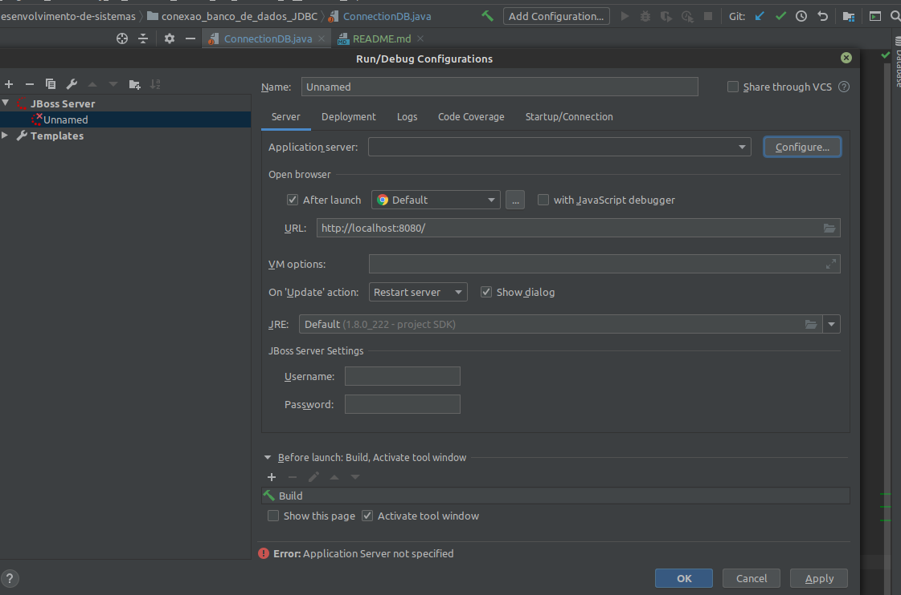

# Criação de um Servidor de Aplicação

1. Faça o download da versão Java EE no WildFly
```bash
wget https://download.jboss.org/wildfly/17.0.1.Final/wildfly-17.0.1.Final.zip
```

2. Descompacte
```bash
unzip wildfly-17.0.1.Final.zip
```

3. Clique em `Add Configuration`




4. Clique no menu esquerdo em `JBoss Server > Unnamed`


5. Selecione o servidor


6. Renomei a aplicação, selecione a versão do java, na aba deplyment, selecione o war (artefato) e por fim clique em apply e ok.


